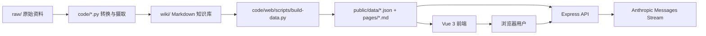

# 架构

## 数据流

1. 原始资料放入 `raw/`，保持只读。
2. `convert_existing.py` 转换概念、公司、人物基础页面。
3. `ingest.py` 调用 Anthropic API 生成访谈和股东信摘要。
4. `update_index.py` 生成 Wiki 目录。
5. `build-data.py` 生成前端静态索引、图谱、搜索数据和 Markdown 副本。
6. 前端直接读取预编译数据，后端聊天接口基于同一份数据构建上下文。

